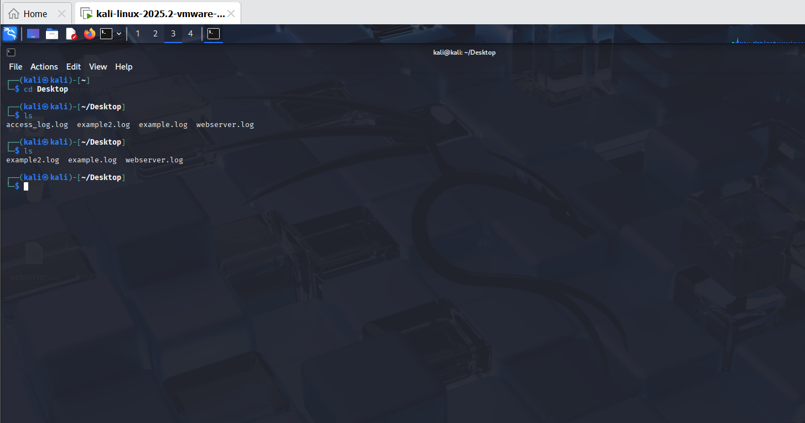

# Checkpoint Intro To CyberSecurity
- First, I downloaded some VMs (virtualbox and vmware) for this checkpoint.

- Then I started by downloading the files I will use through a link provided in the platform and I made sure I saved them in the home directory with the username/password as follows (username:kali/password:kali)

- I started the kali, played with some basic kali commands; `cd, ls`.

I cd into the folder I downloaded my files into, 'Desktop',
I then used the 'ls' command to list the files in the folder 

- Cat command allows you to view the content of one or more files :

I used the command cat -n example.log example2.log to number the files.

>[!NOTE]
To find out the various functions of a command, call the command followed by a space and `--help`

- In order to save the output I used redirection to save the output inside a file :

cat -n example.log example2.log > access_log.log

I used the head command to show the first 10 lines: 
head access_log.log

I also used the tail command to show the last 10 lines: 
tail access_log.log

- To check the functions of the logger command, I used 'logger --help',
I then added information to the syslog located in /var/log/syslog by :
logger “This is Timmy”

- To check the functions of the grep command, I used 'grep --help'

I tried to use the Grep command to filter the output based on one value :
grep -i kali /var/log/syslog, and I got an error message saying I dont have syslog file

So I installed syslog file by running the following commands
`sudo apt update` , `sudo apt install rsyslog` , `sudo systemctl enable rsyslog`, `sudo systemctl start rsyslog`. 

- I retried the Grep command to filter the output based on one value :
grep -i kali /var/log/syslog

- I filtered the log file for words containing p,l,c :
grep [plc] access_log.log

I also filtered the output of the log for lines containing IP addresses:
grep -E "[^^][0-9]{1,3}.[0-9]{1,3}.[0-9]{1,3}.[0-9]{1,3}" webserver.log

#### The End Of Checkpoint 1