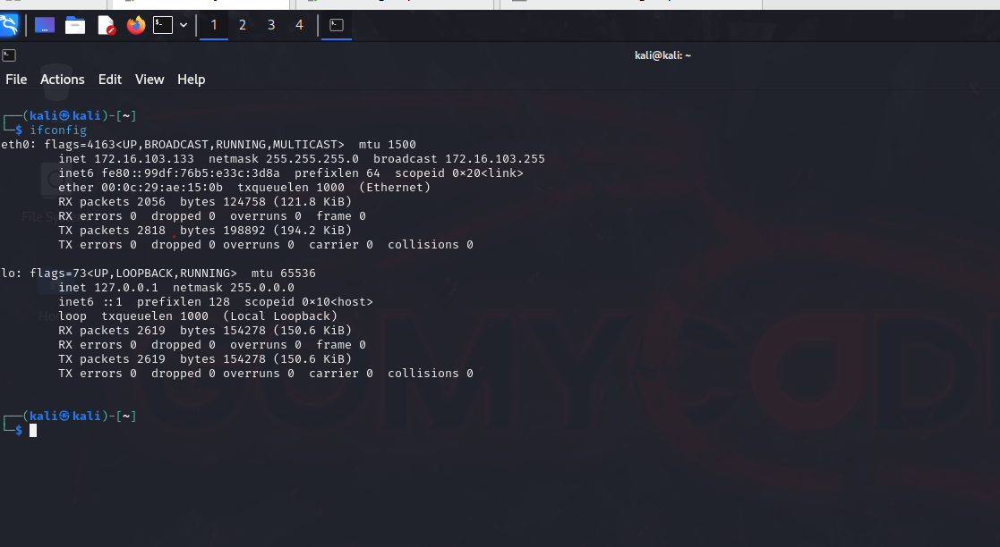
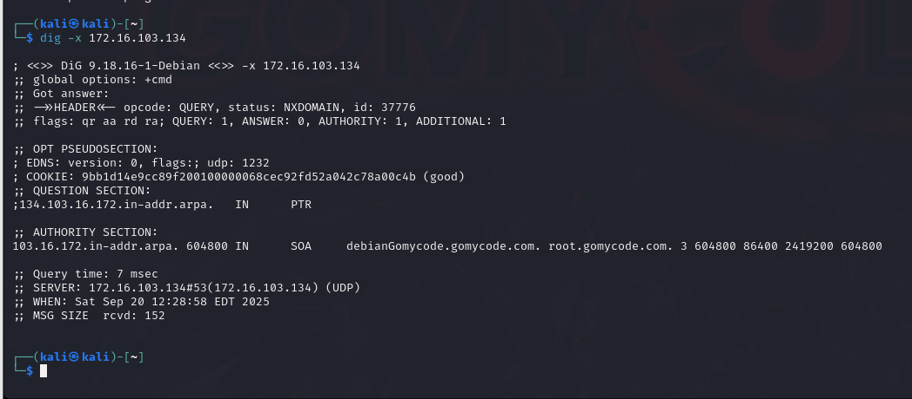

# CHECKPOINT 2: NETWORKING
###### NAME: OBELEAGU CHINAZA TIMOTHY

Having the ability to analyse the network is so important for cyber security engineers especially when we are trying to identify the infrastructure of the network we will need to work on different operating systems

What I Aim For;
Perform Network Reconnaissance...

During this checkpoint, I tried to identify different nodes using different tools

 
##### steps
- After I downloaded the three virtual machines; kali linux, debian and windows server from the provided link on the platform, I used the tools to identify the different IP address of the kali linux (username: kali/password: kali) , windows (password: Gomycode01*) and debian OS (password: Gomycode01*)....
I ran the commands on each vm terminals;
-`ifconfig` on kali

`ipconfig` on windows

`ip addr` on debian

- I used nmap to identify the different ports running on The different machines

- Using `nslookup` I identified the FQND of the following IP : 3.33.130.190

- I used the `ping` command to verify the communication with the following ip : 172.16.103.134

- I used the `dig` command to identify it’s FQND 

- I re-verified by pinging : debianGomycode.gomycode.com

- On the windows server I made sure that the IIS is running

- To identify that the server running is (Microsoft IIS/10.0), On the kali linux machine I ran the command `curl -I windowsServer.gomycode.com` but it gave me an error.

- I had to hard-fork my windows server with the followiing steps;

- I then ran the curl command again, and it was successful

- On kali linux machine I opened firefox and tried to visit windowsServer.gomycode.com. I was able to access the windows website.

- On the windows server I went to tools -> internet information service (IIS)

- Clicked on the server name,
 On the IIS section under ftp section I clicked on : authentication
 
- I right clicked on Anonymous Authentication and chose disable
I also right clicked on the Basic Authentication and chose enable

- On kali linux firefox I refreshed the windows server website,

- I Checked the communications between kali and windows with the following command `sudo tcpdump -vv dst windowsServer.gomycode.com and port www -w auth.txt`
- I reloaded the website and tried to login using some random credentials (username and password are wrong ) 
- Then I stopped the tcpdump command using CTRL+C
- I launched wireshark auth.txt
- I openend the  GET request  and identified the credentials

# THE END OF CHECKPOINT 2